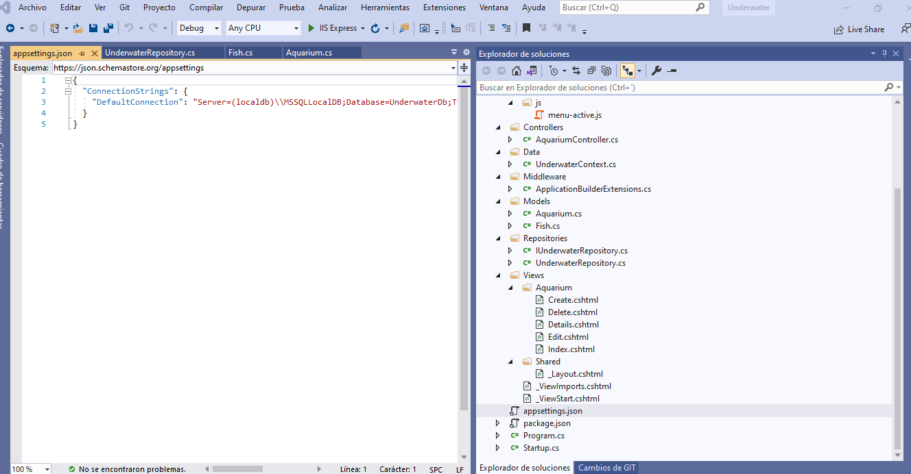
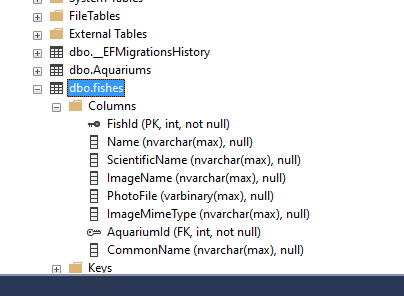

## Module 14: Hosting and Deployment

### Lab: Hosting and Deployment


Preparación: abrimos el proyecto Lab: Hosting and Deployment ( https://github.com/MicrosoftLearning/20486D-DevelopingASPNETMVCWebApplications/tree/master/Allfiles/Mod14/Labfiles/01_Underwater_begin ).

instalamos las depencias con npm install

```c#
{
  "version": "1.0.0",
  "name": "asp.net",
  "private": true,
  "devDependencies": {},
  "dependencies": {
    "jquery": "3.5.0",
    "jquery-validation": "1.17.0",
    "jquery-validation-unobtrusive": "3.2.10",
    "bootstrap": "4.3.1",
    "popper.js": "1.14.3"
  }
}
````


Examinamos el proyecto 

 


Starup.cs

````c#
.....

        public void ConfigureServices(IServiceCollection services)
        {
            services.AddTransient<IUnderwaterRepository, UnderwaterRepository>();

            services.AddDbContext<UnderwaterContext>(options =>
                options.UseSqlServer(_configuration.GetConnectionString("DefaultConnection")));

            services.AddMvc();
        }
.....
````

Antes de ejecutarlo le creamos la primera Migración

````c#
Add-Migration InitialCreate  
Update-Database
````

 


Probamos la aplicación

 


Para desplegarla en Azure

Nos creamos un web App + SQL


 


 


 


 


 

 
 


 


En vez de añadir nodemodules al proyecto insteamos el siguiente código a Underwater.csproj 

```c#
<ItemGroup>
	<Content Include="node_modules\**" CopyToPublishDirectory="PreserveNewest" />
</ItemGroup>
```


y publicamos ...

 

 

 

 

 

 

 

 

 
 
 Camos a modficar el modelo  Fish.cs.
 
```c#
	[Display(Name = "Common  Name:")]
	public string CommonName { get; set; }
```


como hemos modificado el módelos, modifcamos las vistas para añadir el nuevo campo 


Aquarium.Details.cshtml
```c#
<div>
	 <p class="display-label">
		 @Html.DisplayNameFor(model => model.CommonName)
	 </p>
	 <br />
	 <p class="display-field">
		 @Html.DisplayFor(model => model.CommonName)
	 </p>
</div>
```

Create.cshtml
```c#
<div class="form-group row">
	<label asp-for="CommonName" class="col-sm-6 col-form-label"></label>
	<div class="col-sm-6">
		<input asp-for="CommonName" type="text" class="form-control" placeholder="Common Name" required>
		<span asp-validation-for="CommonName"></span>
	</div>
</div>
```

Delete.cshtml
```c#
<div>
	<p class="display-label">
		@Html.DisplayNameFor(model => model.CommonName)
	</p>
	<br />
	<p class="display-field">
		@Html.DisplayFor(model => model.CommonName)
	</p>
</div>
```

y modificamos el controlador

```c#	
var fishToUpdate = _repository.GetFishById(id);
bool isUpdated = await TryUpdateModelAsync<Fish>(
					fishToUpdate,
					"",
					f => f.AquariumId,
					f => f.Name,
					f => f.ScientificName,
					f => f.CommonName
					);
```


Como ya la tenemos pues añadimos la migracion  
Add-Migration AddFishCommonName  
Update-Database  

y vemos que lo modifica en bbdd

 

Probamos la aplicación


 


viendo que funciona publicamos de nuevo


 


 


#### Exercise 2: Upload an Image to Azure Blob Storage

Vamos ahora a crear un Blob Storage


 


 


 

una vez creado el Blob Storage nos creamos un Contenedor llamado aqyuarium


 

y vemos que funciona

 


Una vez creado vamos a modificar la aplicación

en  appsettings.json 

```c#
{
  "ContainerSettings": {
    "ContainerName": "aquarium"
  },
  "ConnectionStrings": {
    "DefaultConnection": "Server=(localdb)\\MSSQLLocalDB;Database=UnderwaterDb;Trusted_Connection=True;MultipleActiveResultSets=true"
  }
}
```

al modelo Fish.cs le añadimos
```c#
 public string ImageURL { get; set; }
````


y las respecitivas vistas

Details.cshtml
```c#
@if (Model.ImageName != null)
{
	@if (Model.ImageURL != null)
	{
		<div class="photo-display">
			
		</div>
	}
	else
	{
		<div class="photo-display">
			
		</div>
	}
}
```

Details.cshtml
```c#
	@if (Model.ImageURL != null)
	{
		
	}
	else
	{
		
	}

```

index.cshtml
```c#
  @if (item.ImageName != null)
   {
       @if (item.ImageURL != null)
       {
           <div class="photo-display">
               
           </div>
       }
       else
       {
           <div class="photo-display">
               
           </div>
       }
   }
```

delete.cshtml
```c#
   @if (Model.ImageName != null)
   {
       @if (Model.ImageURL != null)
       {
            <div>
                
            </div>
       }
       else
       {
            <div>
                
            </div>
       }
   }
```


Añadimos desde Nuget WindowsAzure.Storage version  9.3.3,

 


Finalmente modificamos reposirotrio 

```
using Microsoft.EntityFrameworkCore;
using System;
using System.Collections.Generic;
using System.IO;
using System.Linq;
using System.Threading.Tasks;
using Underwater.Data;
using Underwater.Models;
using Microsoft.WindowsAzure.Storage;
using Microsoft.WindowsAzure.Storage.Blob;
using Microsoft.Extensions.Configuration;
using Microsoft.AspNetCore.Http;

namespace Underwater.Repositories
{
    public class UnderwaterRepository : IUnderwaterRepository
    {
        private UnderwaterContext _context;
        private IConfiguration _configuration;
         private CloudBlobContainer _container;

        public UnderwaterRepository(UnderwaterContext context, IConfiguration configuration)
        {
            _context = context;
            _configuration = configuration;
            string connectionString = _configuration.GetConnectionString("AzureStorageConnectionString-1");
            string containerName = _configuration.GetValue<string>("ContainerSettings:ContainerName");
            CloudStorageAccount storageAccount = CloudStorageAccount.Parse(connectionString);
            CloudBlobClient blobClient = storageAccount.CreateCloudBlobClient();
            _container = blobClient.GetContainerReference(containerName);
        }
        public IEnumerable<Fish> Getfishes()
        {
            return _context.fishes.ToList();
        }

        public Fish GetFishById(int id)
        {
            return _context.fishes.Include(a => a.Aquarium)
                 .SingleOrDefault(f => f.FishId == id);
        }

        public void AddFish(Fish fish)
        {
            if (fish.PhotoAvatar != null && fish.PhotoAvatar.Length > 0)
            {
                string imageURL = UploadImageAsync(fish.PhotoAvatar).GetAwaiter().GetResult();
                fish.ImageURL = imageURL;
                fish.ImageMimeType = fish.PhotoAvatar.ContentType;
                fish.ImageName = Path.GetFileName(fish.PhotoAvatar.FileName);
                _context.Add(fish);
                _context.SaveChanges();
            }
        }

        public void RemoveFish(int id)
        {
            var fish = _context.fishes.SingleOrDefault(f => f.FishId == id);
            if (fish.ImageURL != null)
            {
                DeleteImageAsync(fish.ImageName).GetAwaiter().GetResult();
            }
            _context.fishes.Remove(fish);
            _context.SaveChanges();
        }

        public void SaveChanges()
        {
            _context.SaveChanges();
        }

        public IQueryable<Aquarium> PopulateAquariumsDropDownList()
        {
            var aquariumsQuery = from a in _context.Aquariums
                                orderby a.Name
                                select a;
            return aquariumsQuery;
        }

        private async Task<string> UploadImageAsync(IFormFile photo)
        {
            CloudBlockBlob blob = _container.GetBlockBlobReference(Path.GetFileName(photo.FileName));
            await blob.UploadFromStreamAsync(photo.OpenReadStream());
            return blob.Uri.ToString();
        }

        private async Task<bool> DeleteImageAsync(string PhotoFileName)
        {
            CloudBlockBlob blob = _container.GetBlockBlobReference(PhotoFileName);
            await blob.DeleteAsync();
            return true;
        }
    }
}

````

Deberos añadir la cadena de conexion del blob al appsettings.json`
 
```c#
{
  "ContainerSettings": {
    "ContainerName": "aquarium"
  },
  "ConnectionStrings": {
    "DefaultConnection": "Server=(localdb)\\MSSQLLocalDB;Database=UnderwaterDb;Trusted_Connection=True;MultipleActiveResultSets=true",
    "AzureStorageConnectionString-1": "{Your azure storage connection string}"
  }
}
```

Para buscar la cadena de conexiñon ve a la pantalla Keys 


Añadimos la Migración

Add-Migration AddFishImageURL  
Update-Database


Publicamos de nuevo

y ya tenemos la aplicación tirando del blob storage


